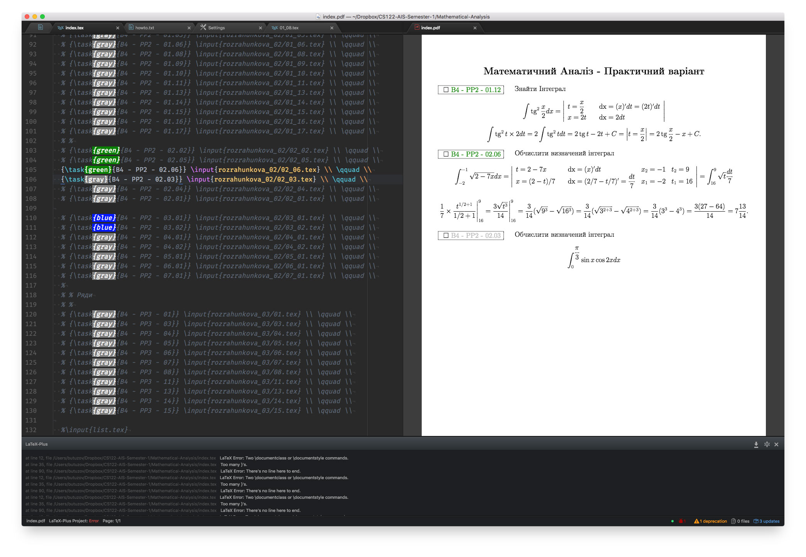

# LaTeX



LaTex
 - UKR http://www.ptep-online.com/ctan/lshort_ukrainian.pdf
 - RUS https://rutracker.org/forum/viewtopic.php?t=4380917
 - RUS (приклади) http://www.ccas.ru/voron/download/voron05latex.pdf

URL
  - TEX StackExchange https://tex.stackexchange.com/
  - LaTeX Help From https://www.sharelatex.com/learn

TEX
  - https://www.latex-project.org/get/
  - https://www.sharelatex.com/


## Редактор для набору

  Atom + плагіни
    - https://atom.io
    - https://atom.io/packages/language-latex
    - https://atom.io/packages/latex-plus


## Генерація превю по збереженню файла реалізована (криво) через `init.coffee` (init script)

```coffeescript
atom.workspace.observeTextEditors (editor) ->
  editor.onDidSave ->
    if 'text.tex.latex' == editor.getGrammar().scopeName.toLowerCase()
       console.log "Running LaTeX Recompile #{editor.getPath()}"
      atom.commands.dispatch( atom.views.getView( editor ), 'latex-plus:compile-and-sync' )
```
