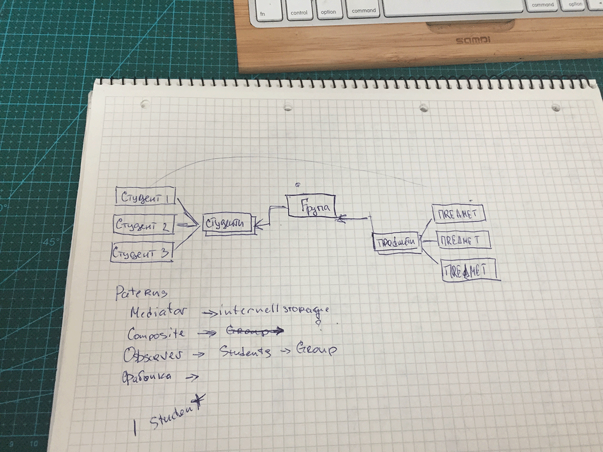

### Демо код Курсової з "Об'єкно Орієнтованого Програмування"

Створення тестового середовища і запуск.

```bash
brew install php@7.1
git clone https://github.com/butuzov/oop-cursova.git && cd oop-cursova
php main.php | less
```



# Пояснення

Після 6 патерну я вирішив вже не продовжувати б дописувати код заради коду,
тому частина функціональності залишиться недописаною. Основне пояснення щодо
використаних патернів у файлі main.php де коротко пояснюється де і які патерни
використані.

Відразу прошу вибачення за код - писав впоспіху, бо "вже пора".
